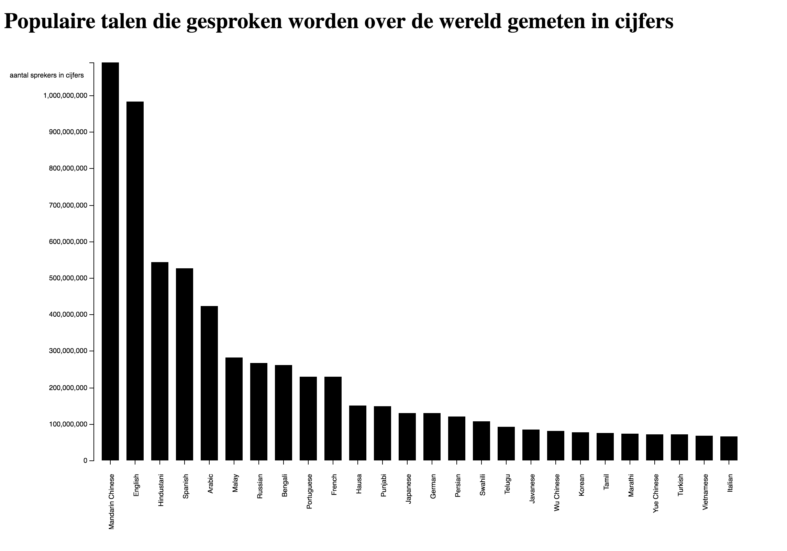

# Assessment 1
Voor deze Assessment moest ik een grafiek maken aan de hand van data die is aangeleverd in een TSV bestand. Aan de hand van deze Assessment laat ik zien dat ik de kennis van de vorige opdrachten (class 1 & 2) heb toegepast

## Achtergrond verhaal
Voor deze assessement heb ik de opdrachten playing with SVG, Loading data, Bar chart, Do you read me, style en debugger; gemaakt. In deze opdrachten heb ik de kennis geleerd om de assessement te kunnen maken de deze pas ik dus toe op de assessement opdracht.

## Data
De data die ik heb gekregen gaat over de meest gesproken talen over de hele wereld. De bron hiervan is wikipedia.nl
De **Y-as** geeft het aantal mensen aan die de taal spreekt in cijfers
De **X-as** geeft aan welke taal er gesproken wordt.

## Opties
- [`D3-DSV`](https://github.com/d3/d3-dsv)
- [`D3-format`](https://github.com/d3/d3-format)
- [`D3-scale`](https://github.com/d3/d3-scale)
- [`D3-array`](https://github.com/d3/d3-array)
- [`D3-axis`](https://github.com/d3/d3-axis)

## Licentie
GNU GPLv3 © Ryan Narain